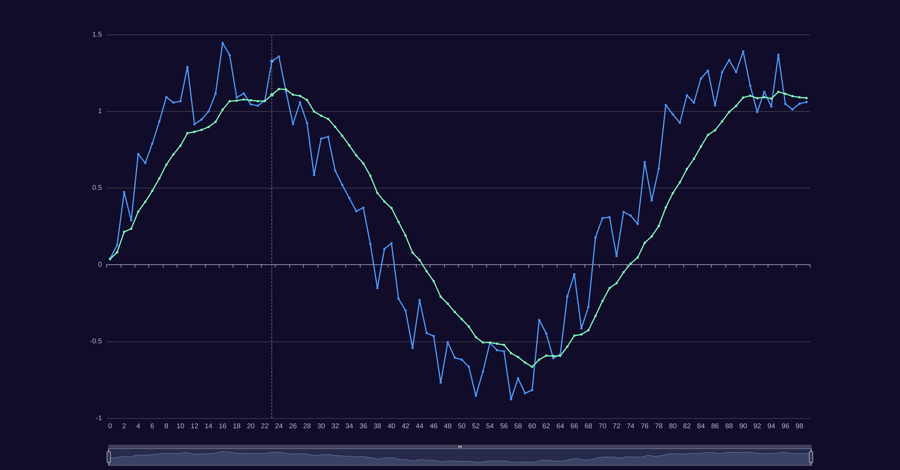

# jukf

Unscented Kalman Filter.

Code ported from https://github.com/prozoroff/UKFSharp

Available at Maven Central:

```
dependencies {
  implementation("io.vacco.jukf:jukf:0.1.0")
}
```

See test case for usage example. Render plot in [eCharts](https://echarts.apache.org/examples/en/editor.html?c=line-simple).


